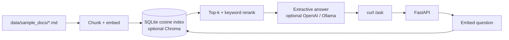

# Company RAG Knowledge Assistant

FastAPI retrieval-augmented generation (RAG) service that answers questions from local markdown. Sample corpus is a **fictional** company, Vision AI Ops (TraceLight / AlertMesh). Portfolio demo only — no hosted URL, no real customer data, no production secrets.

Built for Days 11–18 of a 30-day AI automation plan. **This repo is the Day 11 scaffold:** clone, ingest, ask. Retrieval quality, evals, and optional LLM polish are later days.

Source: [github.com/Birra3324/company-rag-assistant](https://github.com/Birra3324/company-rag-assistant)

## How to demo (under 10 minutes)

```bash
git clone https://github.com/Birra3324/company-rag-assistant.git
cd company-rag-assistant
python3 -m venv .venv
source .venv/bin/activate   # Windows: .venv\Scripts\activate
pip install -r requirements.txt
cp .env.example .env

# 1) Ingest the five sample FAQ/policy docs
python -m app.rag.ingest

# 2) Run the API
uvicorn app.main:app --reload --port 8788
```

In another terminal:

```bash
curl -sS http://127.0.0.1:8788/health

curl -sS http://127.0.0.1:8788/ask \
  -H "content-type: application/json" \
  -d '{"question":"How many PTO days do employees receive?"}'

curl -sS http://127.0.0.1:8788/query \
  -H "content-type: application/json" \
  -d '{"question":"Can we keep TraceLight data in the EU?"}'
```

`POST /query` is an alias of `POST /ask`. Interactive docs: [http://127.0.0.1:8788/docs](http://127.0.0.1:8788/docs).

If `AUTO_INGEST_ON_STARTUP=true` (default outside tests), the first API boot ingests `data/sample_docs/` when the vector store is empty — so you can skip the ingest command after a fresh clone.

## Architecture



Default path is fully local: **hashing-trick embeddings + SQLite cosine store + extractive answers**. No GPU, no API key, no extra containers.

## Stack

| Piece | Day 11 default | Optional via env |
| --- | --- | --- |
| API | FastAPI 3.12, port **8788** | — |
| Embeddings | Local signed hashing (384-d, numpy) | `sentence-transformers` MiniLM, or OpenAI `text-embedding-3-small` |
| Vector store | SQLite + numpy cosine | `VECTOR_BACKEND=chroma` after `pip install -r requirements-ml.txt` |
| Generator | Extractive sentences + citations | OpenAI chat, or Ollama (`llama3.2`) |
| Tests | pytest + TestClient; embeddings/LLM mocked or local hashing | CI never calls OpenAI or loads GPU models |

This is not an iPaaS/RPA demo and does not claim UiPath, Workato, MuleSoft, or ServiceNow.

## API

| Method | Path | Notes |
| --- | --- | --- |
| GET | `/` | Service pointers |
| GET | `/health` | Chunk count, providers, backend |
| POST | `/ingest` | Re-read `DOCS_PATH` and rebuild the index |
| POST | `/ask` | `{ "question": "...", "top_k": 4 }` |
| POST | `/query` | Same body as `/ask` |

Example `200` from `/ask` (shape, not a live capture):

```json
{
  "answer": "Full-time employees receive **20 PTO days** of paid time off each calendar year, accrued monthly...\n\nSources: Time Off and Leave Policy.",
  "sources": [
    {
      "source": "02-pto-policy.md",
      "title": "Time Off and Leave Policy",
      "score": 0.41,
      "excerpt": "## PTO days\n\nFull-time employees receive **20 PTO days** of paid time off..."
    }
  ],
  "retrieved": 4,
  "embedding_provider": "local",
  "llm_provider": "extractive"
}
```

`POST /ask` returns **409** if the store is empty (ingest first).

## Sample documents

Fictional Vision AI Ops content under `data/sample_docs/`:

1. Company overview (TraceLight, AlertMesh, Cambridge listing)
2. PTO and leave (20 PTO days, 8 sick days, parental leave)
3. IT security and acceptable use (MFA, no real secrets in chat)
4. Customer support FAQ (P1 = 30 minutes, EU-West residency)
5. Remote work and expenses ($150 stipend, hybrid Tues/Thu)

Drop additional `.md` / `.txt` files in that folder and `POST /ingest` again.

## Environment variables

See `.env.example`. Important ones:

| Variable | Purpose |
| --- | --- |
| `EMBEDDING_PROVIDER` | `local` (default), `sentence-transformers`, or `openai` |
| `LLM_PROVIDER` | `extractive` (default), `openai`, or `ollama` |
| `OPENAI_API_KEY` | Only when a provider is `openai`. Never hard-coded. |
| `VECTOR_BACKEND` | `sqlite` (default) or `chroma` |
| `DOCS_PATH` | Defaults to `data/sample_docs` |
| `AUTO_INGEST_ON_STARTUP` | Ingest when the store is empty (`false` in pytest) |

OpenAI and sentence-transformers are **opt-in**. Leaving the key blank keeps the local path.

Better local embeddings (downloads MiniLM on first use):

```bash
pip install -r requirements-ml.txt
# in .env
EMBEDDING_PROVIDER=sentence-transformers
VECTOR_BACKEND=chroma   # optional
```

## Testing

```bash
python3 -m venv .venv
source .venv/bin/activate
pip install -r requirements.txt
python -m pytest
```

Tests use a temp SQLite file, local hashing (or a mock embedder/generator), and block OpenAI HTTP from the RAG layer. They do not need a GPU, Chroma, or API keys. The same command runs on GitHub Actions (push/PR to `main`, Python 3.12).

## Docker

```bash
docker compose up --build
curl -sS http://127.0.0.1:8788/health
```

The image is `python:3.12-slim`. Compose runs only the API; the index lives in a volume. OpenAI remains optional via `OPENAI_API_KEY`.

## Project layout

```
app/            FastAPI app, settings, RAG pipeline
data/sample_docs/   Fictional FAQ + policy markdown
scripts/        ingest.sh, run_dev.sh
tests/          pytest (mocked / local, no keys)
.github/workflows/ci.yml
```

## Status and later days

Day 11: working scaffold, sample docs, local RAG, pytest, Docker, CI.

Days 12–18 (not in this PR): token-aware chunking, hybrid BM25 + dense retrieval, eval questions, citation highlighting, optional auth, quality tuning for MiniLM/OpenAI embeddings.

## License

MIT © 2026 Birra Gemedi
