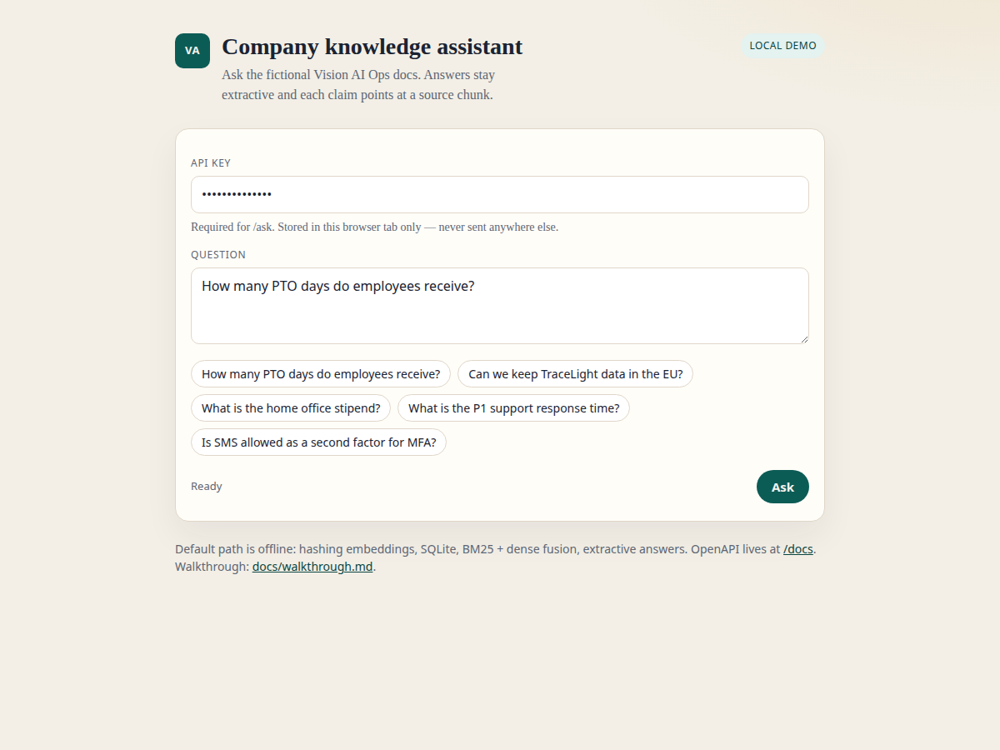
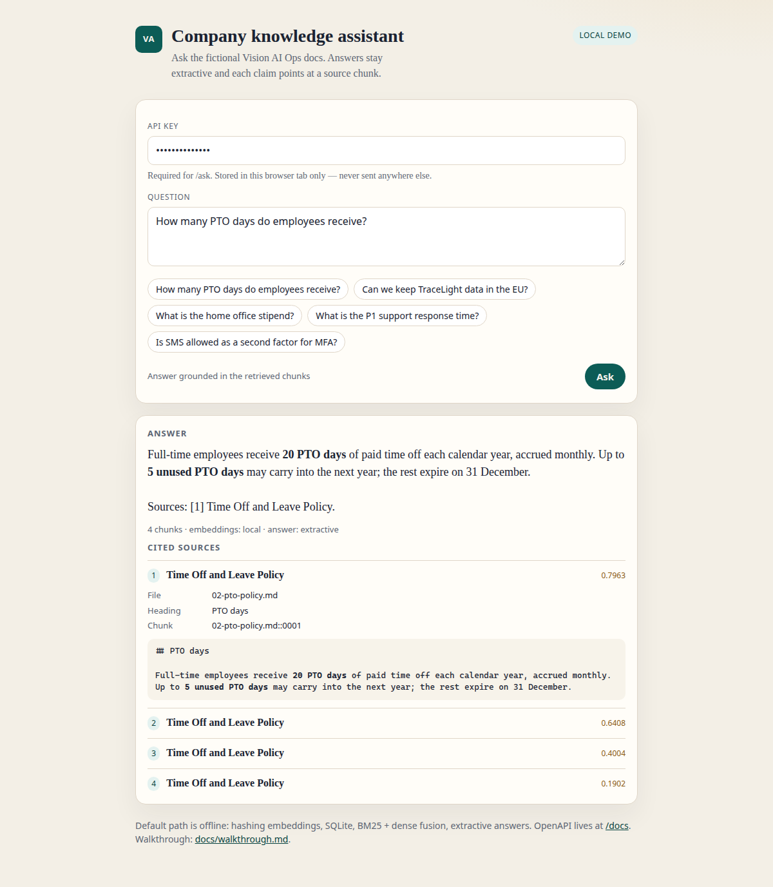
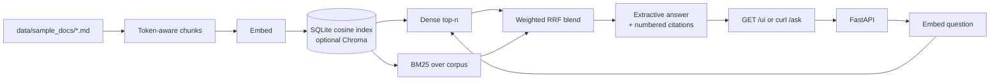

# Company RAG Knowledge Assistant

> Open to remote AI automation roles. Email: birragimedi@gmail.com | GitHub: @Birra3324 | LinkedIn: linkedin.com/in/birra-gemedi

FastAPI retrieval-augmented generation (RAG) service that answers questions from local markdown. Sample corpus is a **fictional** company, Vision AI Ops (TraceLight / AlertMesh). Portfolio demo only — no hosted URL, no real customer data, no production secrets.

Implemented: token-aware chunking, hybrid BM25 + vector retrieval, source citations, a browser page at `/ui`, an offline evaluation harness, and demo API-key / rate limits. The default uses local hashing embeddings and extractive answers. MiniLM, OpenAI, and Ollama are optional and are not required to run the demo.

Hiring-manager walkthrough (about 10 minutes): [docs/walkthrough.md](docs/walkthrough.md).

Source: [github.com/Birra3324/company-rag-assistant](https://github.com/Birra3324/company-rag-assistant)

## How to demo (under 10 minutes)

```bash
git clone https://github.com/Birra3324/company-rag-assistant.git
cd company-rag-assistant
python3 -m venv .venv
source .venv/bin/activate   # Windows: .venv\Scripts\activate
pip install -r requirements.txt
cp .env.example .env
# Set a strong API_KEY in .env before starting the HTTP service.

# 1) Ingest the five sample FAQ/policy docs
python -m app.rag.ingest

# 2) Run the API (auto-ingests sample docs when the index is empty)
uvicorn app.main:app --host 127.0.0.1 --port 8788
```

Open [http://127.0.0.1:8788/ui](http://127.0.0.1:8788/ui), paste the same `API_KEY`, and ask a question. Citations expand to the document title, section heading, chunk id, and snippet.





In another terminal:

```bash
export API_KEY="your-private-configured-key"  # same value as .env
curl -sS http://127.0.0.1:8788/health

curl -sS http://127.0.0.1:8788/ask \
  -H "X-API-Key: $API_KEY" \
  -H "content-type: application/json" \
  -d '{"question":"How many PTO days do employees receive?"}'

curl -sS http://127.0.0.1:8788/query \
  -H "X-API-Key: $API_KEY" \
  -H "content-type: application/json" \
  -d '{"question":"Can we keep TraceLight data in the EU?"}'
```

`POST /query` is an alias of `POST /ask`. Interactive docs: [http://127.0.0.1:8788/docs](http://127.0.0.1:8788/docs).

If `AUTO_INGEST_ON_STARTUP=true` (default outside tests), the first API boot ingests `data/sample_docs/` when the vector store is empty — so you can skip the ingest command after a fresh clone.

## Architecture


```mermaid
flowchart LR
  Docs["data/sample_docs/*.md"] --> Chunk["Token-aware chunks"]
  Chunk --> Embed["Embed"]
  Embed --> Store[("SQLite cosine index\noptional Chroma")]
  User["GET /ui or curl /ask"] --> API[FastAPI]
  API --> EmbedQ["Embed question"]
  EmbedQ --> Dense["Dense top-n"]
  Store --> Dense
  Store --> BM25["BM25 over corpus"]
  Dense --> Fuse["Weighted RRF blend"]
  BM25 --> Fuse
  Fuse --> Gen["Extractive answer\n+ numbered citations"]
  Gen --> User
```

Default path is fully local: **hashing-trick embeddings + SQLite cosine store + BM25 hybrid retrieval + extractive answers**. No GPU, no vendor API key, no extra containers. The HTTP service still expects a local `API_KEY` you choose yourself.

## Stack

| Piece | Default (offline) | Optional via env |
| --- | --- | --- |
| API | FastAPI on Python 3.12, port **8788** | Browser page at `GET /ui` |
| Limits | Demo API key, 64 KiB body, `top_k` ≤ 12, 120 req/min | `RATE_LIMIT_PER_MINUTE=0` disables the limiter |
| Chunking | Header-aware, **token** windows (`CHUNK_SIZE=180`) | — |
| Embeddings | Local signed hashing (384-d, numpy) | `sentence-transformers` MiniLM, or OpenAI `text-embedding-3-small` |
| Retrieval | Dense cosine + BM25 fused (RRF) | `VECTOR_BACKEND=chroma` after `pip install -r requirements-ml.txt` |
| Generator | Extractive sentences + `[n]` citations | OpenAI chat, or Ollama (`llama3.2`) |
| Eval | `evals/golden.json` + `python -m app.rag.eval_harness` | — |
| Tests | pytest + TestClient; embeddings/LLM mocked or local hashing | CI never calls OpenAI or loads GPU models |

This is not an iPaaS/RPA demo and does not claim UiPath, Workato, MuleSoft, or ServiceNow.

## API

| Method | Path | Notes |
| --- | --- | --- |
| GET | `/` | Service pointers, including `/ui` |
| GET | `/ui` | Browser demo: ask a question, expand citations. Public. |
| GET | `/health` | Chunk count, providers, backend. Public. |
| POST | `/ingest` | Re-read `DOCS_PATH` and rebuild the index. Requires `X-API-Key`. |
| POST | `/ask` | `{ "question": "...", "top_k": 4 }`. Requires `X-API-Key`. |
| POST | `/query` | Same body as `/ask`. Requires `X-API-Key`. |

`POST /ask` returns **413** when the body exceeds `MAX_BODY_BYTES`, **422** when the question or `top_k` exceeds the demo caps, and **429** (`Retry-After`) when the per-process rate limit is hit. `/health` and `/ui` are not rate limited.

Example `200` from `/ask` (shape, not a live capture):

```json
{
  "answer": "Full-time employees receive **20 PTO days** of paid time off each calendar year, accrued monthly...\n\nSources: [1] Time Off and Leave Policy.",
  "sources": [
    {
      "source": "02-pto-policy.md",
      "title": "Time Off and Leave Policy",
      "score": 0.41,
      "excerpt": "## PTO days\n\nFull-time employees receive **20 PTO days** of paid time off...",
      "chunk_id": "02-pto-policy.md::0001",
      "heading": "PTO days"
    }
  ],
  "retrieved": 4,
  "embedding_provider": "local",
  "llm_provider": "extractive"
}
```

`POST /ask` returns **409** if the store is empty (ingest first). Source titles come from the document H1; `chunk_id` and section `heading` are optional extras for citations.

## Sample documents

Fictional Vision AI Ops content under `data/sample_docs/`:

1. Company overview (TraceLight, AlertMesh, Cambridge listing)
2. PTO and leave (20 PTO days, 8 sick days, parental leave)
3. IT security and acceptable use (MFA, no real secrets in chat)
4. Customer support FAQ (P1 = 30 minutes, EU-West residency)
5. Remote work and expenses ($150 stipend, hybrid Tues/Thu)

Drop additional `.md` / `.txt` files in that folder and `POST /ingest` again.

## Chunking (`CHUNK_SIZE`)

`CHUNK_SIZE` and `CHUNK_OVERLAP` are **approximate word tokens**, not characters. A token is an alphanumeric sequence (the same tokenizer the local hashing embedder uses). English prose is ~4 characters per token, so the Day 11 700-character window is about 180 tokens.

- Default `CHUNK_SIZE=180`, `CHUNK_OVERLAP=40`
- Markdown headings bound sections first
- Long sections pack paragraphs, then sentences, then token windows
- The section heading is prepended onto each piece so a split FAQ still retrieves

## Environment variables

See `.env.example`. Important ones:

| Variable | Purpose |
| --- | --- |
| `EMBEDDING_PROVIDER` | `local` (default), `sentence-transformers`, or `openai` |
| `LLM_PROVIDER` | `extractive` (default), `openai`, or `ollama` |
| `OPENAI_API_KEY` | Only when a provider is `openai`. Never hard-coded. |
| `VECTOR_BACKEND` | `sqlite` (default) or `chroma` |
| `DOCS_PATH` | Defaults to `data/sample_docs` |
| `CHUNK_SIZE` | Target tokens per chunk (default 180) |
| `CHUNK_OVERLAP` | Overlapping tokens (default 40) |
| `RETRIEVE_K` | Chunks returned to the generator (default 4) |
| `RETRIEVE_POOL` | Dense shortlist size before BM25 fusion (default 24) |
| `AUTO_INGEST_ON_STARTUP` | Ingest when the store is empty (`false` in pytest) |
| `API_KEY` | Required to boot. Sent as `X-API-Key` on `/ask`, `/query`, `/ingest` |
| `MAX_TOP_K` | Tightens `top_k` (default 12; absolute ceiling 50) |
| `MAX_QUESTION_CHARS` | Tightens question length (default 2000; absolute ceiling 8000) |
| `MAX_BODY_BYTES` | Rejects larger POST bodies with 413 (default 65536) |
| `RATE_LIMIT_PER_MINUTE` | Cap for `/ask`, `/query`, `/ingest` (default 120; `0` disables) |

OpenAI and sentence-transformers are **opt-in**. Leaving the key blank keeps the local path.

Optional MiniLM embeddings (downloads `sentence-transformers/all-MiniLM-L6-v2` on first use; not used in CI):

```bash
pip install -r requirements-ml.txt
# in .env
EMBEDDING_PROVIDER=sentence-transformers
VECTOR_BACKEND=chroma   # optional
```

Re-run ingest after changing `EMBEDDING_PROVIDER`. Hashing vectors and MiniLM vectors are not interchangeable. `tests/test_sentence_transformers_optional.py` stubs the library, so the default hashing path and CI never need a GPU, a model download, or network access to Hugging Face.

## Testing

```bash
python3 -m venv .venv
source .venv/bin/activate
pip install -r requirements.txt
python -m pytest
```

Tests use a temp SQLite file, local hashing (or a mock embedder/generator), and block OpenAI HTTP from the RAG layer. They do not need a GPU, Chroma, or API keys. The same command runs on GitHub Actions (push/PR to `main`, Python 3.12).

## Eval harness

Golden questions live in `evals/golden.json` (expected source files + keywords). The scorer ingests the sample corpus with the default offline stack and checks source retrieval and expected keywords in the answer alone:

```bash
python -m app.rag.eval_harness
python -m app.rag.eval_harness --json
# or
scripts/eval.sh
```

Pass rate must be at least **0.75** (9/12 on the current golden set is the CI floor; the default path usually clears more). No GPU and no API keys. pytest covers the same path in `tests/test_eval_harness.py`.

## Docker

```bash
docker compose up --build
curl -sS http://127.0.0.1:8788/health
```

The image is `python:3.12-slim`. Compose runs only the API; the index lives in a volume. OpenAI remains optional via `OPENAI_API_KEY`.

## Project layout

```
app/                FastAPI app, settings, RAG pipeline
app/static/         Single-page citation UI served at /ui
app/rag/chunking.py Token-aware header-aware splitter
app/rag/retrieve.py BM25 + dense hybrid fusion
app/rag/eval_harness.py  Offline eval CLI
data/sample_docs/   Fictional FAQ + policy markdown
evals/golden.json   Golden questions for the sample corpus
scripts/            ingest.sh, run_dev.sh, eval.sh, capture_ui.py
tests/              pytest (mocked / local, no keys)
docs/walkthrough.md Recruiter / hiring-manager walkthrough
docs/status.md      Days 11–18 checklist
docs/ui-*.png       Screenshots from a headless run of /ui
.github/workflows/ci.yml
```

## Status

**Days 11–18 are done.** The demo is frozen for review: offline hashing path, optional MiniLM, citation UI, demo API key and request limits, screenshots, and [docs/walkthrough.md](docs/walkthrough.md).

See [docs/status.md](docs/status.md) for the checklist. The golden harness currently passes **11/12** (rate 0.92, floor 0.75) on the default offline stack.

## License

MIT © 2026 Birra Gemedi

## Access and evaluation boundaries

`POST /ingest`, `/ask`, and `/query` require `X-API-Key`. Startup rejects missing or blank `API_KEY`; health stays public. Compose requires the key and binds to loopback by default. The offline ingestion/evaluation CLI does not use the HTTP API and needs no service key.

The keyword score checks the generated answer alone. Retrieved excerpts can no longer make an empty or incorrect answer pass. This is a small deterministic evaluation, not a benchmark of factual accuracy: semantic correctness, unsupported questions, citation grounding, adversarial inputs, and document-update behavior still require broader evaluation. The in-process rate limit and shared demo key are enough for a local review. Per-user authorization, distributed limits, provider-cost controls, monitoring, and corpus lifecycle controls still belong in front of any multi-user host. See [docs/walkthrough.md](docs/walkthrough.md).
