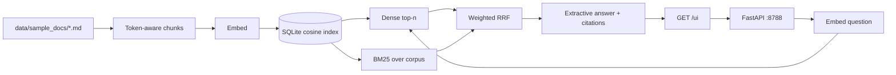

# Recruiter walkthrough

A 10-minute look at the local RAG assistant. The corpus is fictional (Vision AI Ops). There is no hosted URL and no customer data.

## What problem this solves

Support and policy questions get re-asked in Slack. This service answers from a small markdown knowledge base and shows the chunk it used. The default path runs on a laptop: no GPU, no model download, no API key for an LLM vendor.

It is a portfolio piece for AI automation / Python work: ingestion, hybrid retrieval, citations, an offline eval, and a small demo UI. It is not an iPaaS or RPA product.

## Architecture



| Piece | Default | Optional |
| --- | --- | --- |
| Embeddings | Signed hashing, 384-d | MiniLM (`sentence-transformers/all-MiniLM-L6-v2`) or OpenAI |
| Index | SQLite + numpy cosine | Chroma (`VECTOR_BACKEND=chroma`) |
| Answers | Extractive sentences with `[n]` titles | OpenAI chat or Ollama |
| UI | `GET /ui` static page | — |

Switching embedding models means re-ingesting. The vector spaces are not compatible.

## Run it in 3 commands

From a fresh clone, with Python 3.12. The third command is the server. `local-demo-key` is a stand-in — use any private value you like.

```bash
python3 -m pip install -r requirements.txt
cp .env.example .env && sed -i 's/^API_KEY=$/API_KEY=local-demo-key/' .env
python3 -m uvicorn app.main:app --host 127.0.0.1 --port 8788
```

Open [http://127.0.0.1:8788/ui](http://127.0.0.1:8788/ui). Paste the same key, ask a question. `AUTO_INGEST_ON_STARTUP` loads `data/sample_docs/` when the index is empty, so a separate ingest step is unnecessary.

`GET /health` and `GET /ui` are public. `POST /ask`, `/query`, and `/ingest` need header `X-API-Key`.

## Sample questions

These match the golden set:

- How many PTO days do employees receive?
- Can we keep TraceLight data in the EU?
- What is the home office stipend?
- What is the P1 support response time?
- Is SMS allowed as a second factor for MFA?

The answer text ends with `Sources: [1] …`. The page lists each hit as an expandable citation: document title, section heading, chunk id, and a snippet.

## Eval results

Command: `python -m app.rag.eval_harness` (also `scripts/eval.sh`). It ingests the sample docs with the **default offline stack** and scores retrieval plus keywords in the answer only. Excerpts cannot carry a wrong answer.

Latest local run on this revision:

| | |
| --- | --- |
| Passed | **11 / 12** |
| Pass rate | **0.92** |
| CI floor | 0.75 |
| Embeddings | `local` (hashing) |
| Generator | `extractive` |

11 cases pass both retrieval and keywords. `hybrid-days` ("Which weekdays are Cambridge-area employees asked to be on-site?") retrieves `05-remote-work.md` but the extractive picker quotes the higher-ranked Cambridge office chunk, so the keyword `Tuesday` is missing from the answer. That is a known limit of first-chunk extractive selection, not a retrieval miss.

pytest on this revision: **51 passed, 1 skipped**. CI runs the same pytest file plus the harness. Neither step calls OpenAI or downloads MiniLM.

## Design trade-offs

- **Hashing embeddings by default.** Quality is weaker than MiniLM, and strong enough on a five-document FAQ when BM25 is fused in. CI stays offline. MiniLM is a real code path (`EMBEDDING_PROVIDER=sentence-transformers`) covered by tests that stub `SentenceTransformer` so weights are never downloaded.
- **BM25 weighted above dense** in reciprocal rank fusion, because the hashing embedder misses paraphrases. Heading overlap is a third, smaller signal.
- **Extractive answers instead of an LLM.** Every sentence is copied from a retrieved chunk, so the demo cannot invent a PTO number. Fluency is worse than a chat model, and the picker can stop on a related chunk (the Cambridge case above). OpenAI and Ollama are optional and untested against the golden set.
- **SQLite cosine index.** One file, no extra process. Chroma is optional and not required for the demo.
- **Shared demo API key, not SSO.** Missing or wrong keys fail closed (401 / startup error). A single in-process rate limit (default 120 requests/minute on `/ask`, `/query`, `/ingest`) plus body size and `top_k` caps keep a public demo from accepting huge payloads. `RATE_LIMIT_PER_MINUTE=0` disables the limiter. The counter is memory-only and per process.
- **Small keyword eval.** It guards regressions on this corpus. It does not measure citation faithfulness, unsupported questions, or adversarial prompts.

## What I would do next in production

- Per-user auth and document ACLs, instead of one shared key.
- A hosted index, incremental ingest, and a way to delete or version a source.
- An LLM answer path with a grounding check: refuse when the retrieved chunks do not contain the fact, and keep the extractive path as fallback.
- Distributed rate limits and a hard spend cap on any paid embedding or chat provider.
- A larger eval: unanswerable questions, citation overlap with the answer, and a diff when a policy file changes.
- Tracing (request id is already on every response) shipped to a real log store.

I would not put this demo on the public internet as-is.
